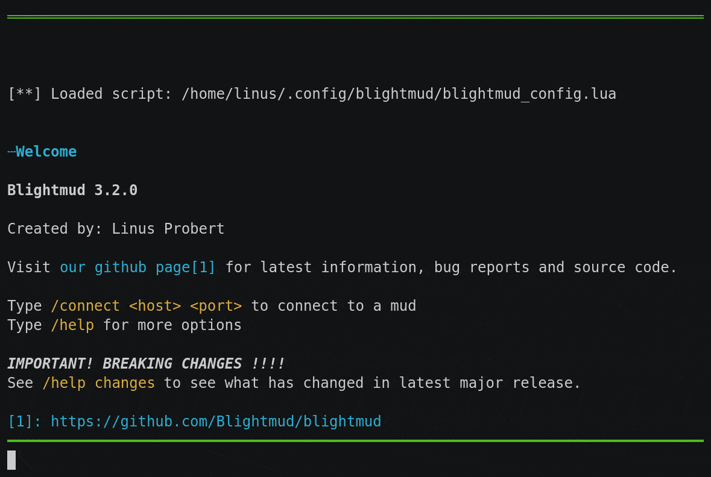

# Blightmud  : A mud client for the terminal

Blightmud has been a passion project of mine for some time. A big user of the old
but great tinyfugue I always wanted to create my own similar mud client. Even
though I don't play much muds these days.

## The name?
The client is written in rust. Some navigating throught the thesaurus brought me to the word 'blight' and here we are.

## Features
- Completely terminal based (mac and linux)
- Telnet:
    - TLS connections
    - GMCP support
    - MCCP2 support (compress2)
- Lua scripting:
    - Output and sending
    - Aliases
    - Triggers
    - GMCP hooks and sending
    - Timers
    - Customizing status bar
    - Persistent storage
    - Keybindings
- Low resource and fast
- In client help and manuals
- Tab completion

## Compiling
- Install rust
- Run `cargo build` to compile
- Run `cargo run` to run

## Installation
- **Ubuntu/Debian**      : Deb packages can be found on the releases page
- **Archlinux/Manjaro**  : Packages are available on AUR
- **Mac/Homebrew**       : We have a homebrew tap `brew tap LiquidityC/blightmud`
- **Other/Alternative**  : Download source and run `cargo install --path .` from the project root

## Support, questions and help
Join our [discord](https://discord.gg/qnxgUC5)

## Contributing
All contributions are welcome. Check out [contributing guidelines](CONTRIBUTING.md).

## Contributors

## Side notes
This is my first rust project that has actually grown a bit. Some things might look silly but thanks to rust they should still be safe. Anywho. If you find some antipattern where you have a better idea I'm more then happy to se the PR and learn some more rustier ways.
