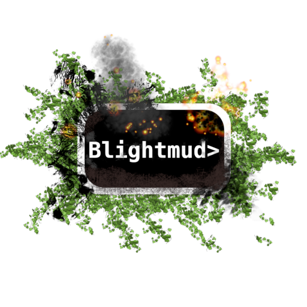

  

# Blightmud  : A mud client for the terminal

Blightmud has been a passion project of mine for some time. A big user of the
old but great [tinyfugue](http://tinyfugue.sourceforge.net/) I always wanted to
create my own similar mud client. Even though I don't play much muds these
days.

## The name?

The client is written in rust. Some navigating throught the thesaurus brought
me to the word **blight** and here we are.

## Features

- Completely terminal based (mac and linux)
- Telnet:
  - TLS
  - GMCP
  - MSDP
  - MCCP2 (compress2)
  - NAWS
  - TTYPE
  - TELNET CHARSET
  - MSSP
- Lua scripting:
  - Output and sending
  - Aliases
  - Triggers
  - Timers
  - Customizing status bar
  - Persistent storage
  - Session storage
  - Keybindings
  - Audio playback (music/ambiance and sound effects)
  - Text-To-Speech
  - Mouse scrolling
  - Plugins
  - Sockets (TCP connecting and sending only)
  - Spellchecking
- Low resource and fast
- In client help and manuals
- Native Text-To-Speech functionality (optional compile)
- Text searching
- Tab completion
- Split view when scrolling
- Screen reader friendly mode

## Demo

## Compiling

- Install rust
- Run `cargo build` to compile
- Run `cargo run` to run

Dependencies include, openssl, alsa-libs and pkg-config
- Ubuntu    `apt install pkg-config libopenssl-dev libasound2-dev libclang-dev`
- Arch      `pacman -S pkgconf alsa-lib openssl clang`

### Compile with text-to-speech

- Install rust
- Run `cargo build --all-features` to compile
- Run `cargo run --all-features` to run

In order for this to build correctly you will need to install some additional
dev dependencies: **libclang** and **libspeechd**. Below are some installation
commands that might fit your system:

- Ubuntu    `apt install libclang-dev libspeechd-dev speech-dispatcher speech-dispatcher-espeak espeak`
- Arch      `pacman -S speech-dispatcher espeak`

### Compile without spellchecking

Some users may encounter issues building the spellcheck feature on MacOS ARM64 (M1/M2). To
build Blightmud without the spellcheck feature, use `--no-default-features`. E.g.:

- Install rust
- Run `cargo build --no-default-features` or `cargo build --no-default-features --features text-to-speech`
- Run `cargo run --no-default-features` or `cargo run --no-default-features --features text-to-speech` to run

### Nix

If you're using [Nix](https://nixos.org/) or NixOS you can try Blightmud
right away with:

- `nix run github:blightmud/blightmud`

For developers, once you've cloned this repo you can use the 
[Blightmud flake](flake.nix) directly, or with [direnv](https://direnv.net/), to
have a ready-to-go and self-contained build environment:

- Run `nix build` to build Blightmud without text to speech.
- Run `nix build .#blightmud-tts` to build Blightmud with text to speech.
- Run `nix develop` to enter a dev. env. with Rust nightly.
- Run `nix develop .#stable` to enter a dev. env. with the latest stable Rust.

## Installation

- **Ubuntu/Debian**      : Deb packages can be found on the releases page
- **Archlinux/Manjaro**  : Packages are available on [AUR](https://aur.archlinux.org/packages/?O=0&K=blightmud)
- **NixOS/Nix**          : Packages are available in [NixPkgs](https://search.nixos.org/packages?channel=unstable&from=0&size=50&sort=relevance&type=packages&query=blightmud), or from our [Flake](flake.nix)
- **Mac/Homebrew**       : We have a homebrew tap `brew tap Blightmud/blightmud` (intel only, if you're on Apple Silicon (darwin) compiling is the best option)
- **Cargo**              : If you have rust installed just run `cargo install --git https://github.com/blightmud/blightmud blightmud` from your favourite terminal.
- **Other/Alternative**  : Download source and run `cargo install --path .` from the project root
- **Windows**            : No native windows support but Blightmud runs fine under WSL

## Support, questions and help

Join our [discord](https://discord.gg/qnxgUC5) post an [issue](https://github.com/Blightmud/Blightmud/issues/new/choose) or post a question in [discussions](https://github.com/Blightmud/Blightmud/discussions)

## Contributing

All contributions are welcome. Check out [contributing guidelines](CONTRIBUTING.md).

## Side notes

This is my first rust project that has actually grown a bit. Some things might
look silly but thanks to rust they should still be safe. Anywho. If you find
some antipattern where you have a better idea I'm more then happy to se the PR
and learn some more rustier ways.
